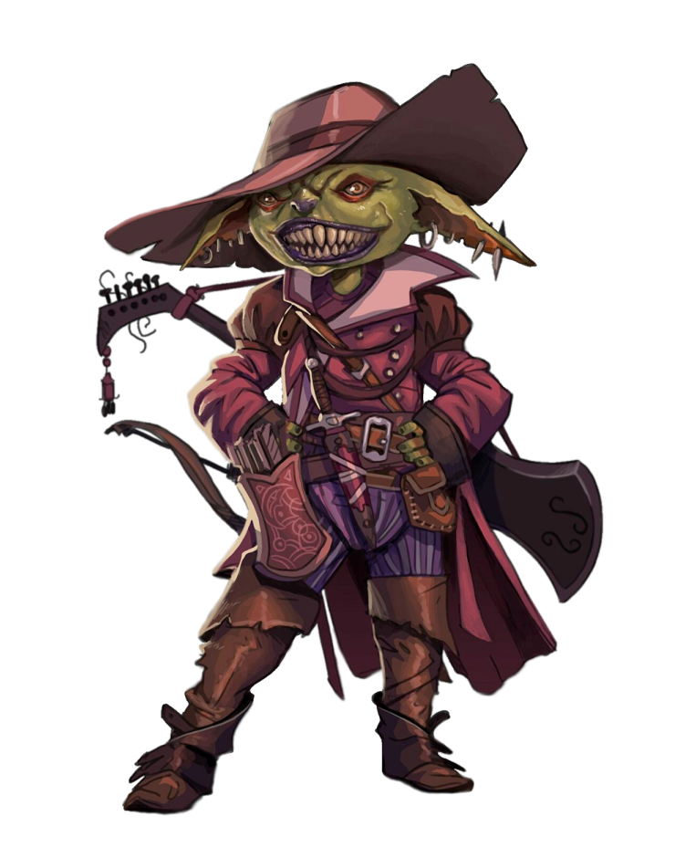
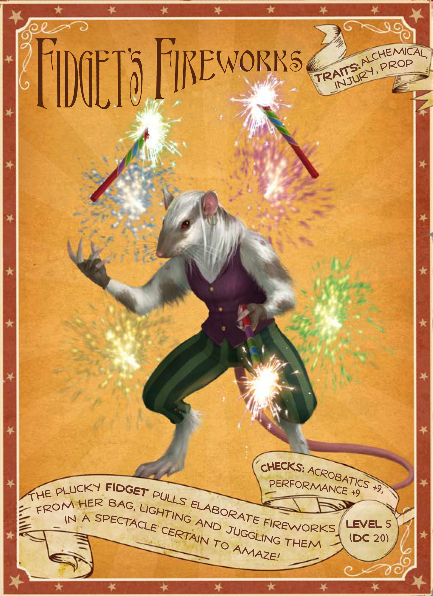
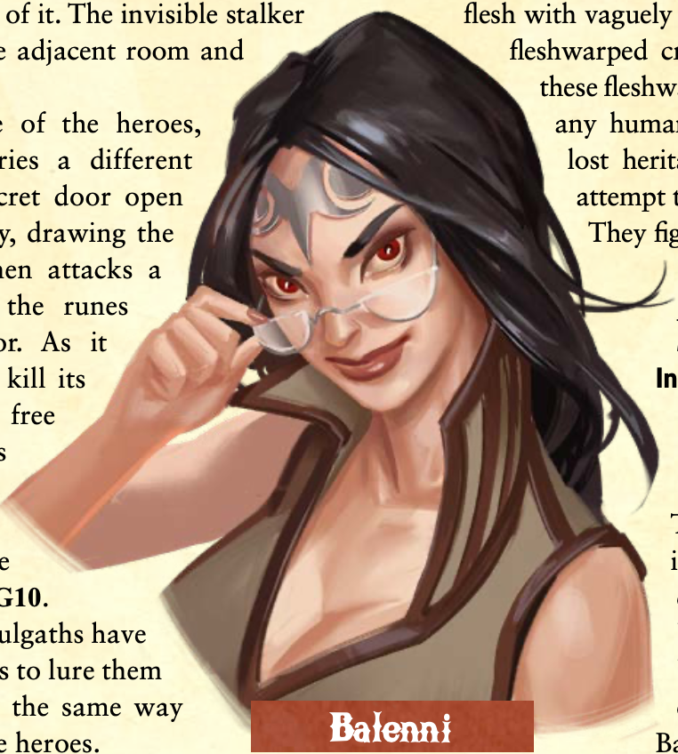
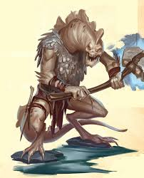

# Notes
^ references characters named for this campaign
# Circus of Wayward Wonders
## Wondous Troupe
### Isaac Sarn

### Jaak Turngear

### Koren Wagoner

### ManJe' Foxx

### Mithril-Dar

### Portia

### Zathra "Azure Treasure"

## Other Performers
Axel and His Amazing Aviary

Dwarven throwers

Elizia the snake charmer (Level 4+1 Trick)
* Mister Tickles

Feather-Fall five (Level 4 Trick)
* Kanbali family - Aihab^ and Dhelbi^ (parents), Odvi^, Xondi^, and Sumesh^

Mordaine the Magician

Mordane's Assistant Hod

Flamboni Sisters - Vida^ and Advi^

Fidget

## Sideshow of Everyday Marvels
Professor Zarlian Kyosophus - Half-elf Male

Giddarron Elbus, “The Bearded Man” - Human Male

Tahala Roadwatcher, “The Tattooed Woman” - Human Female

Hesper and Meitas Jaxis, “The Unjoined Twins” - Human Females

Cubby, “The Dog-Faced Dog” - Male Awakened Animal (Beagle)

## Cast of Clowns

* Matteo Sammarco^ - Male
* Lino D'Ambra^ - Male
* Eros Coscia^ - Male
* Lorella Cocca^ - Female
* Oriana Tavani^ - Female
* Donata Mastronardi^ - Female

## Others
Bardolph

Myron "Thunder" Stendhal (deceased)

About 5 other non-performer NPCs

# Abberton & Area
Bindo and Jano Lindell - male human brothers

Cannono (male sprite) and Tarisia (female sprite)

Jae Abber - male human mayor of Abberton

Jaleen and Rhovo - male human drunkards

Hawfton Family - Seirah, Rikart, and Aima
* Rikart Hawfton 
* Seirah Hawfton 
* Aima Hawfton 

Hemmema, a grandmother

Nellyn Drend, priest-banker of Abadar

Ralhain - Male human sheriff (deceased)

Unnamed gnome orchard tender

## Mad Mug
* Lenky & Beina - owners
* Rulf Oddfingers - server
* Pruana Two-Punch, Violet, and associted ruffians

## Hermitage of Blessed Lightning
Bak - gaunt male human

Carlessa - female human animal handler

Ebbern - male human (deceased)

Enkrisha - female human (deceased)

Faldinor - male human (deceased)

Harlock Hamdeel - male human priest

Horba - brute human female

Lessa - elderly female human

Nemmia Bramblecloak (deceased)

Threndel - male human (deceased)

Yoril - Female human (deceased)

# Escadar
Andera Paldreen

Darricus Stallit - Human Senior City Guard

# Celestial Menagerie
## Mistress Dusklight

## Performers
Daring Danika - Female human lion-tamer with Leandrus - Male lion

Delamar Gianvin

Jellico Bounce-Bounce - Male human clown

Ruanna Nyamma - Female half-elf carnival barker

Viktor Volkano - Male Human fire-breather

## Others
Mechanical Carny

# Xulgath and allies 
Balenni - Succubus (deceased)

Cavnakash - Xulgath cleric of Zevgavizeb

