# Physical Aids
## Initiative Tracker
https://www.thingiverse.com/thing:6303252

Add Ons
* Print numbers to track actual intiative
* Print pathfinder relevant conditions
  * condition printable area is 12x12mm 
* Flags for exploration activities

## Condition Rings
https://www.amazon.com/gp/product/B0CNPG3X31/

# PF2 Condition Icons & Collors
Icons from https://game-icons.net/

Class/skill abilities: burgundy (800020)
| Ability | Source Icon | Target Image |
|---------|-------------|--------------|
| [Auto-Searching](https://game-icons.net/1x1/lorc/magnifying-glass.html) |  | 
| [Disarmed](https://game-icons.net/1x1/skoll/drop-weapon.html) |  | 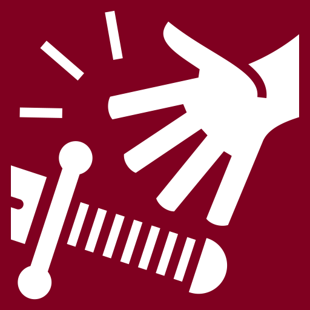
| Distracted | | | 
| [Feinted](https://game-icons.net/1x1/lorc/wave-strike.html) |  | 
| [Raging](https://game-icons.net/1x1/delapouite/enrage.html) |  | 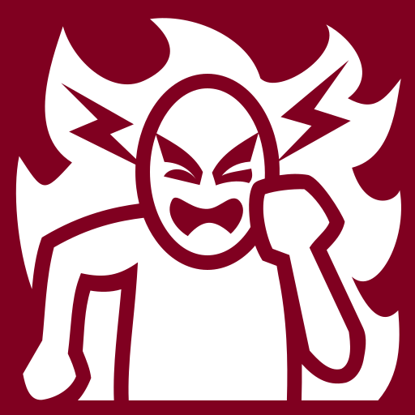
| Reactive Strike 
| [Readied Action](https://game-icons.net/1x1/lorc/stopwatch.html) |  | 

Class/skill buffs: orange (FFA500)
| Ability | Source Icon | Target Image |
|---------|-------------|--------------|
| Aid | |
| [Aura](https://game-icons.net/1x1/lorc/aura.html) |  |  |
| [Bard Song](https://game-icons.net/1x1/lorc/sing.html) |  |  |
| Bonus to saves | |

Disables: yellow (FFFF00)
| Ability | Source Icon | Target Image |
|---------|-------------|--------------|
| [Dying](https://game-icons.net/1x1/lorc/skull-crossed-bones.html)|   | 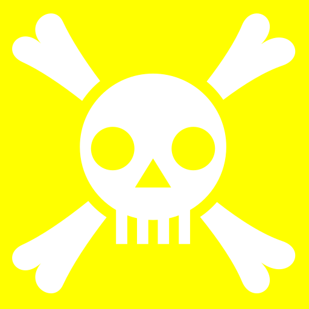 |
| Fleeing
| [paralyzed](https://game-icons.net/1x1/lorc/padlock.html) |  |  |
| [Petrified](https://game-icons.net/1x1/lorc/cracked-mask.html) |  | 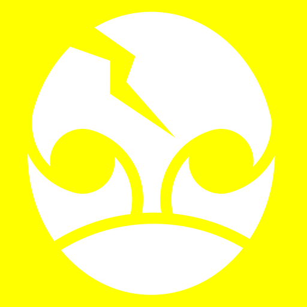 |
| [Stunned](https://game-icons.net/1x1/skoll/knockout.html) |  | 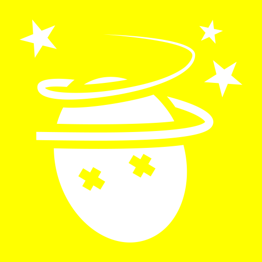 |
| [Unconscious](https://game-icons.net/1x1/delapouite/dead-head.html) |  | 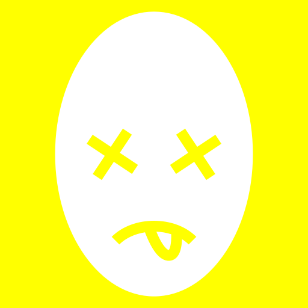 |

Mental manipulation: purple (800080)
| Ability | Source Icon | Target Image |
|---------|-------------|--------------|
| [Confused](https://game-icons.net/1x1/delapouite/perspective-dice-six-faces-random.html) |  | 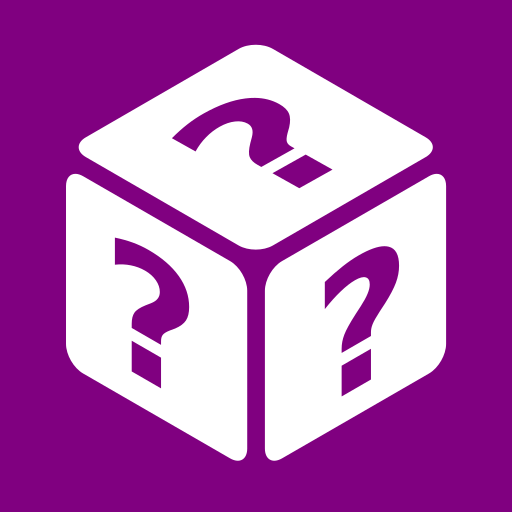 |
| [Controled](https://game-icons.net/1x1/lorc/smitten.html) |  | 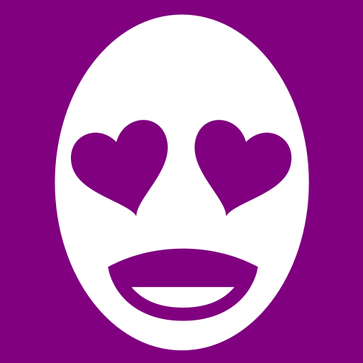 |
| [Fascinated](https://game-icons.net/1x1/delapouite/heart-wings.html) |  |  |

Miscellaneous: pink (FFC0CB)
| Ability | Source Icon | Target Image |
|---------|-------------|--------------|
| Fortune | |
| Off-Guard | |
| Used Reaction | |
| Wounded | |

Physically restricted: gray (808080)
| Ability | Source Icon | Target Image |
|---------|-------------|--------------|
| [Encumbered](https://game-icons.net/1x1/sbed/weight-crush.html) |  |  | 
| [Grabbed](https://game-icons.net/1x1/lorc/grab.html) |  | 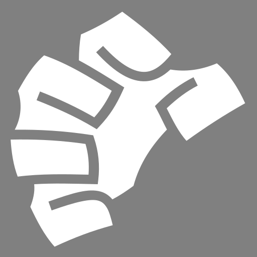 | 
| Fatigued | |
| [Immobilized](https://game-icons.net/1x1/lorc/back-pain.html) |  | 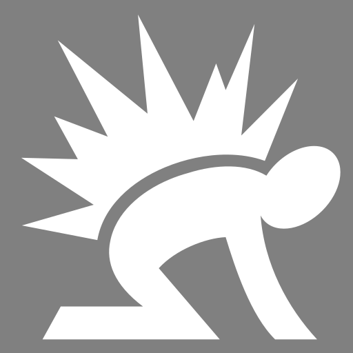 | 
| [Prone](https://game-icons.net/1x1/sbed/falling.html) |  | 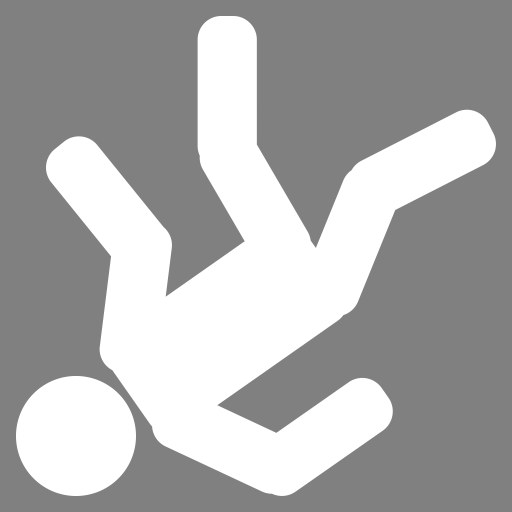 | 
| [Restrained](https://game-icons.net/1x1/lorc/handcuffs.html) |  |  | 
| [Speed Reduced](https://game-icons.net/1x1/delapouite/traffic-lights-orange.html) |  | 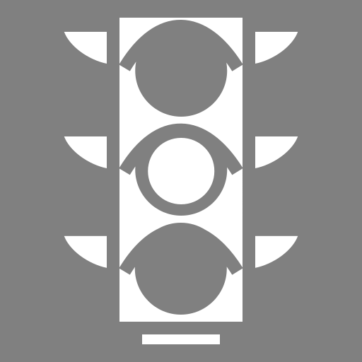

Spell buffs: powder blue (B0CEE2)
| Ability | Source Icon | Target Image |
|---------|-------------|--------------|
| Bless | | |
| Enlarged | | |
| Guidance | | |
| [Quickened](https://game-icons.net/1x1/lorc/fire-dash.html) | | 
| Regeneration | | |
| Runic Body/Weapon | | |
| [Speed Boosted](https://game-icons.net/1x1/lorc/run.html) |  | 
| Truesight | | |

Spell debuffs: red (FF0000)
| Ability | Source Icon | Target Image |
|---------|-------------|--------------|
| [Bane](https://game-icons.net/1x1/lorc/death-zone.html) |  | |
| Speed Reduced | | |

Sustaining: teal (008080)
| Ability | Source Icon | Target Image |
|---------|-------------|--------------|
| Sustaining | |

Visibility/illusion: black (000000)
| Ability | Source Icon |
|---------|-------------|
| [Blinded](https://game-icons.net/1x1/skoll/sight-disabled.html) |  
| [Concealed](https://game-icons.net/1x1/delapouite/carnival-mask.html) |  |
| [Dazzled](https://game-icons.net/1x1/lorc/star-pupil.html) |  |
| [Hidden](https://game-icons.net/1x1/lorc/double-face-mask.html) |  |
| [Invisible](https://game-icons.net/1x1/delapouite/invisible.html) |  |
| [Light source](https://game-icons.net/1x1/lorc/shiny-entrance.html) |  |
| Undetected | |
| [Unnoticed](https://game-icons.net/1x1/delapouite/spy.html) |  |

Weakened: green (00AA00)
| Ability | Source Icon | Target Image |
|---------|-------------|--------------|
| Afflicted | | |
| [Can't Take Reactions](https://game-icons.net/1x1/delapouite/shrug.html) |  |  |
| Clumsy | | |
| [Deafened](https://game-icons.net/1x1/skoll/hearing-disabled.html) |  | 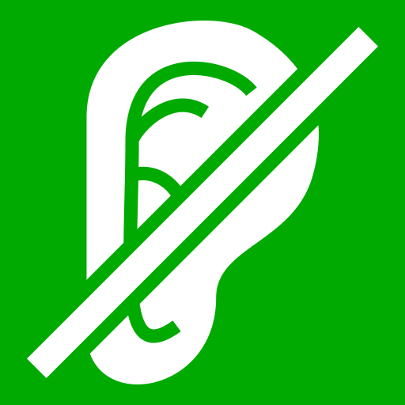 |
| Doomed | | |
| [Drained](https://game-icons.net/1x1/lorc/life-tap.html) |  | |
| [Enfeebled](https://game-icons.net/1x1/lorc/imprisoned.html) |  | |
| [Frightened](https://game-icons.net/1x1/lorc/terror.html) |  |  |
| Minion | | |
| Penalty to Saves | | |
| [Persistant Damage](https://game-icons.net/1x1/lorc/small-fire.html) |  |  |
| [Sickened](https://game-icons.net/1x1/lorc/vomiting.html) |  |  |
| [Slowed](https://game-icons.net/1x1/delapouite/tortoise.html) |  |  |
| [Stupefied](https://game-icons.net/1x1/lorc/nailed-head.html) |  |  |

## Token Mapping - Same
Blind -> blind
Deafened -> Deafened
Dying -> dying
Frightened -> frightened
Grappled -> grabbed
Invisible -> invisible
Paralized -> paralized
Petrified -> petrified
Prone -> prone
Restrained -> restrained
Stunned -> stunned
Unconscious -> unconscious

## Token Mapping -> different
Bleeding -> none
Burning -> persistent damage
Exhausted -> fatigued
Incapacitated -> Immobalized
Poisoned -> sickened

## Other ideas
  Print token/counter to keep track of focus points

# RPG Music
https://syrinscape.com/

https://tabletopaudio.com/
* Combat
    * Rope Bridge
    * Through the Woods
* Generic Background Music
    * Western Watchtower
* Rest
    * Halfling Lodge
    * Long Rest
* Suspense
    * Halfling Sneak

## Sound sources
https://freesound.org/

https://www.findsounds.com/

https://freesfx.co.uk/